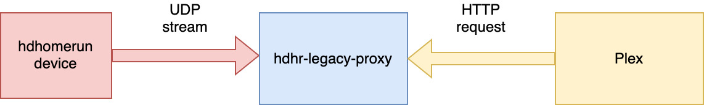

# hdhr-legacy-proxy

This is a proxy that will make a HDHR legacy (HDHR Dual, HDHR 3) act like a newer version
in order to work with Plex Media Center



## Use

```
docker run -it -p 8000:8000/tcp -p 6000:6000/udp ghcr.io/kincl/hdhr-legacy-proxy:latest
```

## TODO

- Option for manually specifying device and not doing autodiscovery
- Implement multiple tuners with a pool of resources
  - https://github.com/jackc/puddle/blob/master/pool.go
  - https://info.hdhomerun.com/info/http_api#specifying_a_tuner
- Document how to use with Docker and Kubernetes
